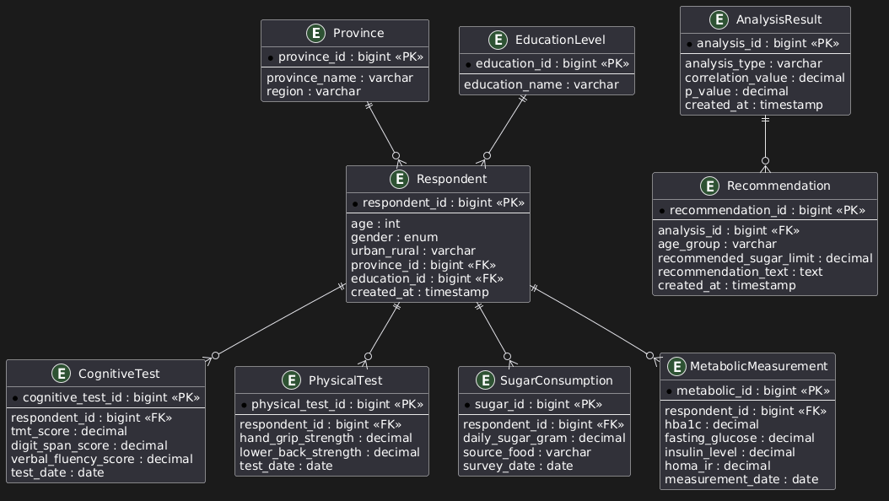

# Tugas APSI Pertemuan 9
## Studi kasus:
> ### Analisis Hubungan Usia, Produktivitas, dan Konsumsi Gula pada Populasi Indonesia (Perspektif Medis)

---

## BRD (Business Requirements Document)

## ERD 

- **Respondent** → Menyimpan data responden (umur, jenis kelamin, pendidikan, provinsi).
- **Province** → Data provinsi responden.
- **EducationLevel** → Data tingkat pendidikan responden.
- **CognitiveTest** → Hasil tes kognitif (TMT, Digit Span, Verbal Fluency).
- **PhysicalTest** → Hasil tes fisik (Hand Grip Strength, Lower Back Strength).
- **SugarConsumption** → Data konsumsi gula harian.
- **MetabolicMeasurement** → Data kesehatan metabolik (HbA1c, Glukosa Puasa, Insulin, HOMA-IR).
- **AnalysisResult** → Hasil analisis statistik dan korelasi data.
- **Recommendation** → Rekomendasi kesehatan berdasarkan hasil analisis.

## Alur Sistem

```text
Respondent
    ├── CognitiveTest
    ├── PhysicalTest
    ├── SugarConsumption
    └── MetabolicMeasurement

AnalysisResult
    └── Recommendation
```

## Tujuan

- Menentukan usia produktivitas kognitif dan fisik tertinggi.
- Mengetahui pola konsumsi gula berdasarkan usia.
- Menganalisis hubungan konsumsi gula dengan produktivitas.
- Menganalisis kondisi metabolik berdasarkan usia.
- Menghasilkan rekomendasi kesehatan berbasis data.

## Code

```
@startuml
entity Province {
    * province_id : bigint <<PK>>
    --
    province_name : varchar
    region : varchar
}
entity EducationLevel {
    * education_id : bigint <<PK>>
    --
    education_name : varchar
}
entity Respondent {
    * respondent_id : bigint <<PK>>
    --
    age : int
    gender : enum
    urban_rural : varchar
    province_id : bigint <<FK>>
    education_id : bigint <<FK>>
    created_at : timestamp
}
entity CognitiveTest {
    * cognitive_test_id : bigint <<PK>>
    --
    respondent_id : bigint <<FK>>
    tmt_score : decimal
    digit_span_score : decimal
    verbal_fluency_score : decimal
    test_date : date
}
entity PhysicalTest {
    * physical_test_id : bigint <<PK>>
    --
    respondent_id : bigint <<FK>>
    hand_grip_strength : decimal
    lower_back_strength : decimal
    test_date : date
}
entity SugarConsumption {
    * sugar_id : bigint <<PK>>
    --
    respondent_id : bigint <<FK>>
    daily_sugar_gram : decimal
    source_food : varchar
    survey_date : date
}
entity MetabolicMeasurement {
    * metabolic_id : bigint <<PK>>
    --
    respondent_id : bigint <<FK>>
    hba1c : decimal
    fasting_glucose : decimal
    insulin_level : decimal
    homa_ir : decimal
    measurement_date : date
}
entity AnalysisResult {
    * analysis_id : bigint <<PK>>
    --
    analysis_type : varchar
    correlation_value : decimal
    p_value : decimal
    created_at : timestamp
}
entity Recommendation {
    * recommendation_id : bigint <<PK>>
    --
    analysis_id : bigint <<FK>>
    age_group : varchar
    recommended_sugar_limit : decimal
    recommendation_text : text
    created_at : timestamp
}
Province ||--o{ Respondent
EducationLevel ||--o{ Respondent
Respondent ||--o{ CognitiveTest
Respondent ||--o{ PhysicalTest
Respondent ||--o{ SugarConsumption
Respondent ||--o{ MetabolicMeasurement
AnalysisResult ||--o{ Recommendation
@enduml
```

## Image




